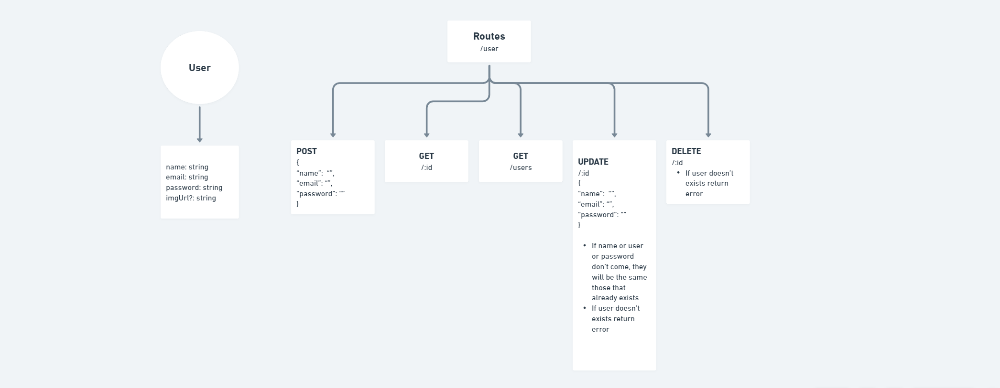

# Tasks

- [x] Entender como funciona o mvc para adicionar banco e se não é melhor usar repository pattern
- [x] Entender o bcriypt e como fazer criptografia de senha
- [x] Entender JWT e aplicar para disponibilizar um token para usuario
- [x] Adicionar banco
- [ ] Tratar melhor os erros deixando mais descritivo, talvez criar uma pasta com um enum só para tratar erros. Achar o padrão de pasta mais utilizado pra isso.
- [ ] Adicionar logica pra tirar o Bearer por ser um padrão não hora que é enviado o token, possivelmente fica na parte do middleware.
- [ ] Entender porque é utilizado Bearer
- [ ] Trocar o getProfile de volta para get e ajustar para que funcione tanto do server quanto no client

## Caso tenha escolhido repository pattern

- [ ] Configurar Jest e testar os métodos

## Caso tenha escolhido o mvc

- [ ] Entender com testar com Jest

## Diagram

